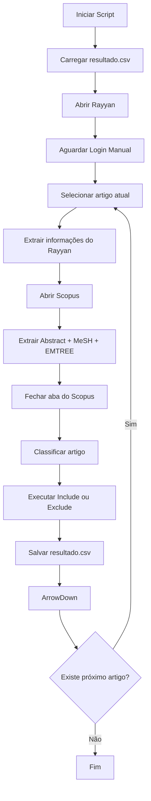

# 🔬 Rayyan & Scopus Smart Screener

[](https://www.python.org/)
[](https://playwright.dev/python/)
[](https://opensource.org/licenses/MIT)

Uma ferramenta de **Automação Robótica de Processos (RPA)** desenvolvida em **Python** e **Playwright** para otimizar a etapa de **triagem (screening)** de artigos científicos na plataforma **Rayyan**, utilizando enriquecimento automático de dados provenientes do **Scopus**.

O sistema analisa os artigos em tempo real e sugere automaticamente as decisões de **Include** ou **Exclude**, baseando-se exclusivamente em critérios objetivos de palavras-chave, além de gerar um relatório completo em formato `.csv` para fins de auditoria e reprodutibilidade científica.

---

# 📑 Índice

- [Funcionalidades](#-funcionalidades)
- [Arquitetura](#-arquitetura)
- [Fluxo de Funcionamento](#-fluxo-de-funcionamento)
- [Critérios de Inclusão](#-critérios-de-inclusão)
- [Pré-requisitos](#-pré-requisitos)
- [Instalação](#-instalação)
- [Como Utilizar](#-como-utilizar)
- [Estrutura do Relatório CSV](#-estrutura-do-relatório-csv)

---

# 🚀 Funcionalidades

## ✅ Triagem totalmente automatizada

Executa automaticamente as ações de **Include** ou **Exclude** diretamente na interface do Rayyan.

---

## ⚡ Navegação inteligente

Utiliza simulação de teclado (`ArrowDown`) para contornar o sistema de **Virtual Scrolling** do Rayyan, permitindo processar milhares de artigos continuamente sem perda de desempenho.

---

## 🔎 Integração com o Scopus

Sempre que disponível, o sistema:

- identifica o link institucional do Scopus;
- abre a página do artigo;
- extrai automaticamente:
  - Abstract completo;
  - Termos **MeSH**;
  - Termos **EMTREE**;
- fecha a aba e retorna ao Rayyan.

---

## 💾 Salvamento incremental (Autosave)

Cada artigo processado é gravado imediatamente no arquivo `resultado.csv`.

Caso a execução seja interrompida:

- nenhum dado é perdido;
- o script continua exatamente do ponto onde parou.

---

## 📋 Auditoria científica

Cada decisão recebe uma justificativa contendo:

- palavras-chave encontradas;
- categorias correspondentes;
- decisão tomada.

---

# 🏗️ Arquitetura

O projeto segue uma arquitetura modular para facilitar manutenção e evolução.

```
Projeto
│
├── config.py
│   Configurações globais
│   Dicionários de palavras-chave
│   URLs
│
├── classifier.py
│   Motor de classificação
│   Regras de decisão
│
├── scraper.py
│   Automação Playwright
│   Extração Rayyan + Scopus
│
└── main.py
    Orquestrador principal
    Controle do fluxo
    Escrita do CSV
```

---

# 🔄 Fluxo de Funcionamento



---

# 🎯 Critérios de Inclusão

O artigo será classificado como **INCLUDE** quando apresentar pelo menos um dos termos monitorados.

| Categoria | Palavras-chave |
|------------|----------------|
| **Animais** | animal experiment, animal model, animal, mouse, mice, rat, rats, guinea pig, rabbit |
| **Antioxidantes** | antioxidant, antioxidants, vitamin C, vitamin E, curcumin, quercetin, resveratrol, N-acetylcysteine, acetylcysteine, rosmarinic acid |
| **Estresse Oxidativo** | oxidative stress, reactive oxygen species, ROS, free radicals, lipid peroxidation, redox balance |
| **Marcadores Inflamatórios** | TNF-alpha, TNF, IL-1, IL-6, IL-10, NF-kB, cytokine, inflammation, inflammatory marker |
| **Cóclea** | cochlea, cochlear, hair cell, auditory hair cell, hearing loss, ototoxicity |
| **Grupo Controle** | control group, controlled study, wild type, vehicle group, placebo |

Caso nenhum termo seja encontrado, o artigo recebe a decisão **EXCLUDE**.

---

# 📦 Pré-requisitos

- Python **3.12** ou superior
- Google Chrome
- Playwright
- Pandas

---

# ⚙️ Instalação

## 1. Clone o repositório

```bash
git clone <url-do-repositorio>
```

ou simplesmente copie os arquivos:

```
config.py
classifier.py
scraper.py
main.py
```

para uma mesma pasta.

---

## 2. Instale as dependências

```bash
pip install playwright pandas
```

---

## 3. Instale o navegador utilizado pelo Playwright

```bash
playwright install chrome
```

---

# ▶️ Como Utilizar

Execute o programa:

```bash
python main.py
```

Em seguida:

1. O Chrome será aberto automaticamente.

2. Faça login normalmente no **Rayyan**.

3. Abra a revisão desejada.

4. Entre na tela de **Screening**.

5. Clique no primeiro artigo da lista lateral para deixá-lo selecionado.

6. Volte ao terminal.

7. Pressione **ENTER**.

---

## Primeiro acesso ao Scopus

Quando o primeiro artigo contendo link para o Scopus for aberto:

- realize o login institucional (CAPES, Universidade etc.);
- aguarde o acesso ser liberado;
- retorne ao terminal;
- pressione **ENTER** novamente.

Esse procedimento será necessário apenas uma única vez.

---

Após isso, o robô executará automaticamente:

- leitura do artigo;
- enriquecimento via Scopus;
- classificação;
- clique em Include/Exclude;
- gravação no CSV;
- navegação para o próximo artigo.

---

# 📊 Estrutura do Relatório CSV

O arquivo `resultado.csv` é salvo utilizando codificação **UTF-8 BOM (`utf-8-sig`)**, garantindo compatibilidade com o Microsoft Excel.

Formato:

| Campo | Descrição |
|--------|-----------|
| **Título** | Título do artigo |
| **Decisão** | INCLUDE ou EXCLUDE |
| **Confiança** | Percentual de confiança da automação |
| **Motivo** | Justificativa da decisão |
| **URL Scopus** | Link do artigo no Scopus |

## Exemplo

| Título | Decisão | Confiança | Motivo | URL |
|--------|----------|-----------|---------|-----|
| FoxO3a plays a key role... | INCLUDE | 100% | Termos encontrados em Animais e Cóclea | https://www.scopus.com/... |
| Effects of noise exposure... | EXCLUDE | 100% | Nenhum termo correspondente encontrado | https://www.scopus.com/... |

---

# 📌 Características Técnicas

- Python 3.12+
- Playwright
- Pandas
- Arquitetura modular
- Processamento incremental
- Compatível com grandes revisões (>1000 artigos)
- Integração Rayyan + Scopus
- Relatório CSV para auditoria científica

---

# 📄 Licença

Este projeto está licenciado sob a licença **MIT**.
